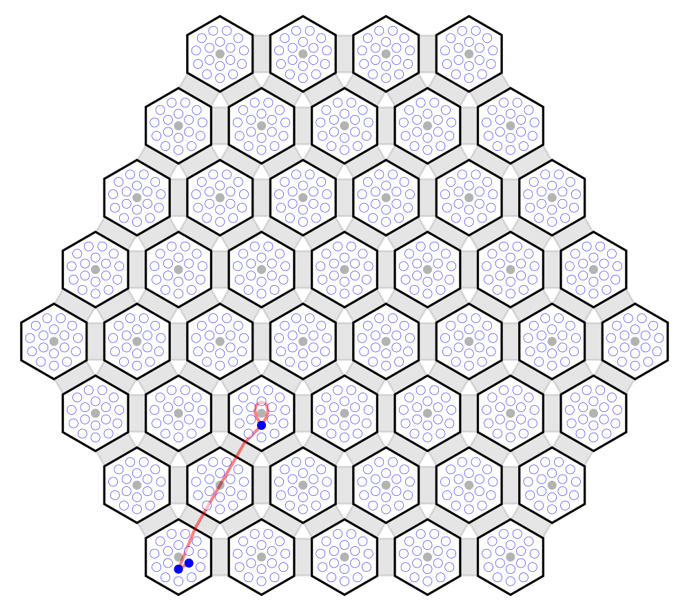

A Preliminary Reference Implementation
======================================

This implementation uses Rig's place and route facilities to perform place and
route via the supplied file formats. The implementation will at some point get
a full suite of tests and get pulled into Rig but for now it will live here...

Rig Interface
-------------

You'll need Rig v0.8.0 or later installed to use these scripts. You can grab
this from [PyPI](https://pypi.python.org/pypi/rig/) as usual:

    pip install "rig>=0.8.0"

Example usage:

    # Place the example netlist
    python rig_place.py --graph=../examples/simple/graph.json \
                        --machine=../examples/simple/machine.json \
                        --constraints=../examples/simple/constraints.json \
                        --placements=placements.json
    
    # Allocate the example netlist (note using the example placement, not the
    # one generated above).
    python rig_allocate.py --graph=../examples/simple/graph.json \
                           --machine=../examples/simple/machine.json \
                           --constraints=../examples/simple/constraints.json \
                           --placements=../examples/simple/placements.json \
                           --allocations=cores:allocations_cores.json \
                           --allocations=sdram:allocations_sdram.json
    
    # Route the example netlist (note using the example placements and
    # allocations, not the ones generated above). Note that unless
    # `--core-resource` is given, the resource type 'cores' will be assumed for
    # cores.
    python rig_route.py --graph=../examples/simple/graph.json \
                        --machine=../examples/simple/machine.json \
                        --constraints=../examples/simple/constraints.json \
                        --placements=../examples/simple/placements.json \
                        --allocations=cores:../examples/simple/allocations_cores.json \
                        --allocations=sdram:../examples/simple/allocations_sdram.json \
                        --routes=routes.json
    
    # Generate a set of routing tables using the example routes.
    python rig_table_generation.py --routes=../examples/simple/routes.json \
                                   --routing-keys=../examples/simple/routing_keys.json \
                                   --routing-tables=routing_tables.json

See the `--help` for each command for more details.

Most commands accept an `--algorithm` argument which allows the user to chose
the algorithm to use rather than just using the Rig default.

See the following Rig documentation pages for a list of available algorithms:

* [Placers](http://rig.readthedocs.org/en/stable/place_and_route/placement_algorithms.html)
* [Allocators](http://rig.readthedocs.org/en/stable/place_and_route/allocation_algorithms.html)
* [Routers](http://rig.readthedocs.org/en/stable/place_and_route/routing_algorithms.html)

Note that the default placer (`sa`) can be quite slow. Try `hilbert` for a fast
but lower quality placement. If you are using the `sa` placer, try adding `-vv`
so that you can see the debug output from the algorithm as it runs.

Rig-PAR-diagram tool
--------------------

[Rig-PAR-diagram](https://github.com/project-rig/rig-par-diagram) is a tool
designed to generate diagrams of placement and routing solutions and SpiNNaker
machines. At present it accepts rig netlsits (just the pickled rig
datastructures) but in the future it will read these JSON files. A script is
provided which produces a suitable netlist file which will work with
rig-par-diagram v0.0.4 and later which can be installed using:

    pip install "rig-par-diagram>=0.0.4"

And used like so:

    # Convert the JSON files into a Rig netlist
    python to_rig_netlist.py --graph=../examples/simple/graph.json \
                             --machine=../examples/simple/machine.json \
                             --constraints=../examples/simple/constraints.json \
                             --placements=../examples/simple/placements.json \
                             --allocations-prefix=../examples/simple/allocations_ \
                             --routes=../examples/simple/routes.json \
                             netlist.pcl
    
    # Draw the netlist with rig-par-diagram
    rig-par-diagram netlist.pcl netlist.png

To produce an image like this:

